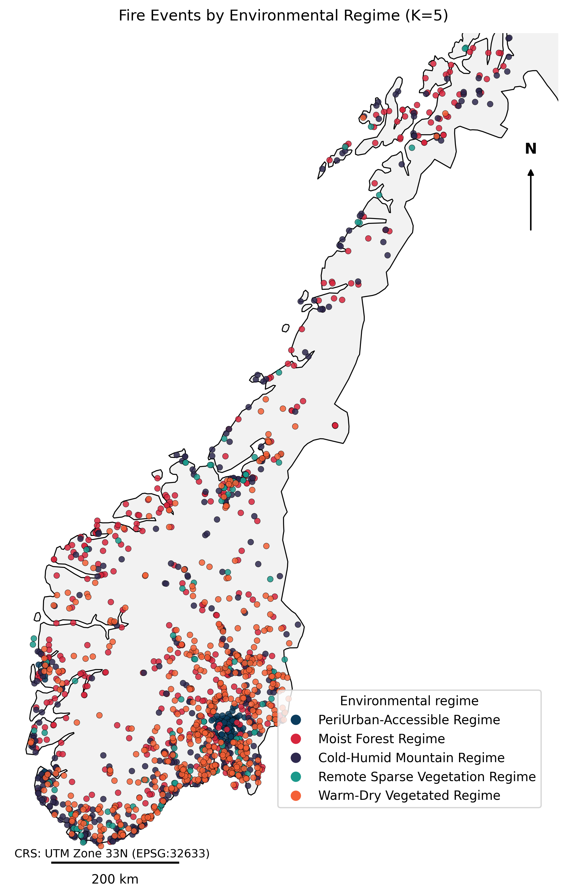
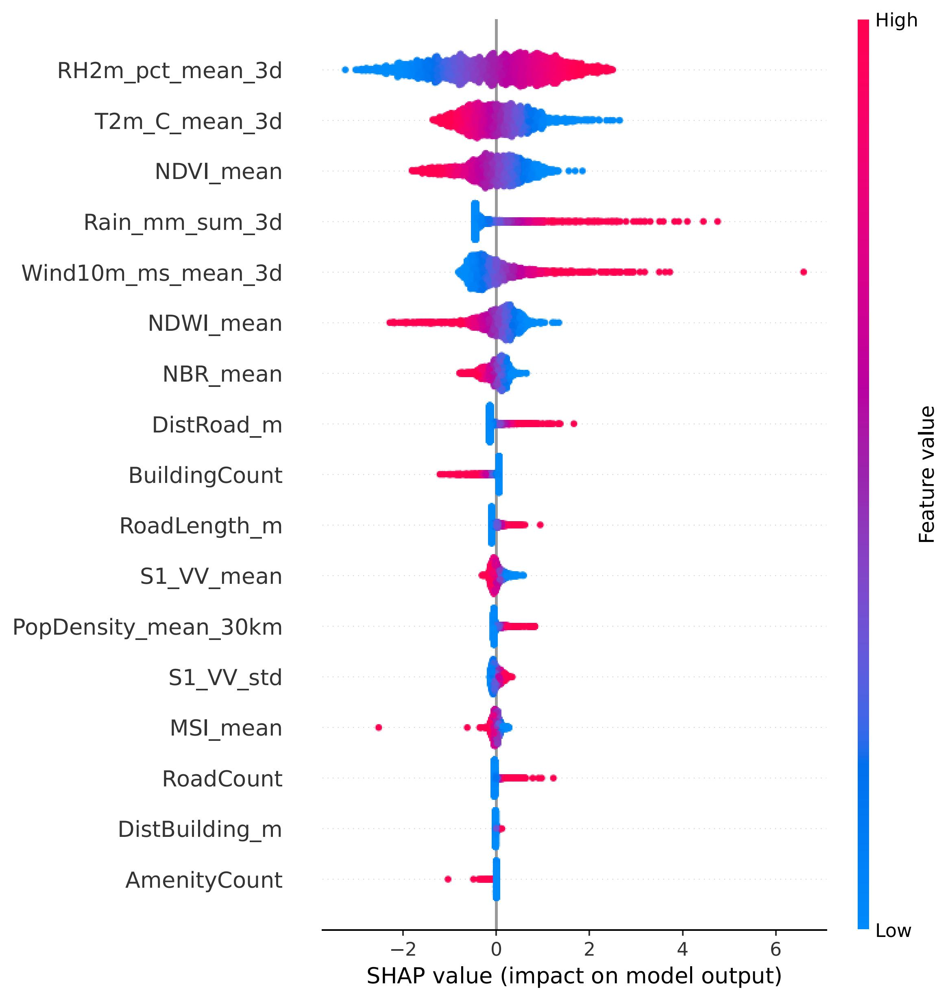

# HybridEO-FireMAP: A Hybrid Framework for Wildfire Ignition Modeling and Risk Mapping Using Earth Observation Foundation Models

<p align="center">
  
</p>

<p align="center">
<b>Figure 1.</b> Overview of the proposed HybridEO-FireMAP framework.
</p>

---

## Overview

HybridEO-FireMAP is a hybrid wildfire ignition prediction and risk mapping framework that combines Earth Observation (EO) Foundation Models with environmental, meteorological, topographic, and anthropogenic predictors.

The framework leverages satellite-derived representations extracted from Earth Observation Foundation Models together with traditional environmental variables to improve wildfire ignition modeling and spatial risk assessment. By integrating deep remote sensing representations and domain-specific environmental predictors, HybridEO-FireMAP provides a scalable and explainable approach for wildfire risk mapping.

The framework was developed and evaluated using georeferenced wildfire incidents recorded across Norway between 2016 and 2025 and is designed to support operational wildfire preparedness and decision-making.

---

## Key Features

- 🔥 Wildfire ignition prediction using multi-source environmental data
- 🛰️ Integration of Earth Observation Foundation Models
- 🌍 Fusion of satellite embeddings and tabular environmental variables
- 📊 Environmental regime-aware wildfire modeling
- 📈 Explainable machine learning and feature importance analysis
- 🗺️ High-resolution wildfire risk mapping
- ⏳ Temporal generalization evaluation on future wildfire seasons

---

## Framework

The proposed workflow consists of five major stages:

1. **Wildfire Event Construction**
   - Historical wildfire incidents
   - Non-fire sample generation

2. **Environmental Feature Extraction**
   - Sentinel-2 optical imagery
   - Sentinel-1 SAR imagery
   - Meteorological variables
   - Vegetation indices
   - Accessibility metrics
   - Population density

3. **Earth Observation Foundation Model Feature Extraction**
   - Satellite image embedding generation
   - Spectral-spatial representation learning

4. **Hybrid Feature Fusion**
   - Foundation model embeddings
   - Environmental variables
   - Feature-level fusion

5. **Wildfire Ignition Modeling and Risk Mapping**
   - Machine learning prediction
   - Wildfire probability estimation
   - Spatial risk map generation

---

## Dataset

The framework utilizes wildfire incidents reported by Norwegian fire and rescue services between 2016 and 2025.

### Environmental Predictors

| Category | Examples |
|-----------|-----------|
| Meteorological | Temperature, Relative Humidity, Wind Speed, Precipitation |
| Vegetation | NDVI, EVI, SAVI |
| SAR | VV, VH Backscatter |
| Topographic | Elevation, Slope, Aspect |
| Accessibility | Distance to Roads and Settlements |
| Anthropogenic | Population Density |

### Satellite Data Sources

- Sentinel-1 SAR
- Sentinel-2 Optical
- ERA5-Land Meteorological Data
- Additional Geospatial Datasets


## Methodology

### Environmental Regime Identification

Environmental conditions are grouped into distinct environmental regimes using unsupervised clustering techniques. These regimes characterize different combinations of meteorological, vegetation, and anthropogenic conditions associated with wildfire occurrence.

### Regime-Aware Stratified Balancing

To improve model robustness and representation of rare environmental conditions, training samples are balanced within environmental regimes.

### Hybrid Feature Fusion

The final feature representation combines:

- EO Foundation Model embeddings
- Meteorological variables
- Vegetation indicators
- Accessibility metrics
- Population density
- Topographic information

The fused representation is used as input to machine learning models for wildfire ignition prediction.

---

## Results

### Wildfire Risk Mapping

<p align="center">
  
</p>

The framework generates spatial wildfire ignition probability maps that identify areas with elevated wildfire risk.

### Environmental Regimes

<p align="center">
  
</p>

Environmental regimes help characterize distinct wildfire ignition environments across Norway.

### Explainability

<p align="center">
  
</p>

Feature importance analysis provides insight into the key drivers of wildfire ignition.

---

## Installation

Clone the repository:

```bash
git clone https://github.com/abdulhanan-AI4EO/HybridEO-FireMAP.git
cd HybridEO-FireMAP
```

Install dependencies:

```bash
pip install -r requirements.txt
```

---


## Citation

If you use this repository in your research, please cite:

```bibtex
@article{hanan2026hybrideofiremap,
  title={HybridEO-FireMAP: A Hybrid Framework for Wildfire Ignition Modeling and Risk Mapping Using Earth Observation Foundation Models},
  author={Hanan, Abdul and others},
  journal={Under Review},
  year={2026}
}
```

---

## Acknowledgements

This work was supported by the **PREWISS (Prediction of Ignition and Spread of Wildfires in Scandinavia)** project (Project No. 315870).

We acknowledge the Norwegian fire and rescue services for wildfire incident records and the Copernicus Programme for providing Sentinel satellite data.

---

## Contact

**Abdul Hanan**  
PhD Research Fellow  
Western Norway University of Applied Sciences (HVL), Norway
Ci2lab.com
For questions, suggestions, or collaborations, please open an issue or contact the authors.
